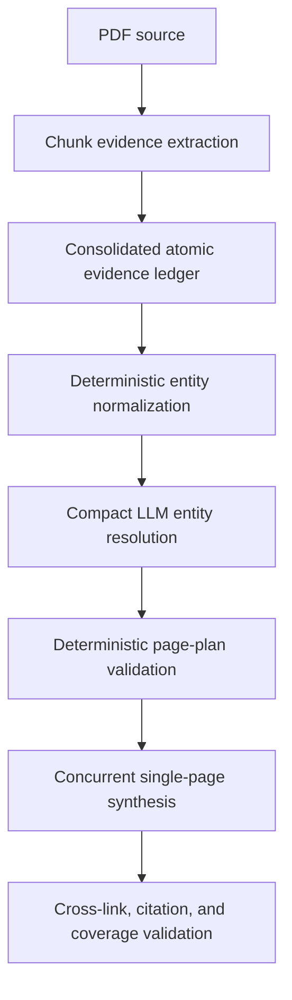

# Hybrid Entity Resolution Ingest Design

## Problem

The ingest pipeline extracts rich, traceable evidence but previously treated evidence records as page candidates. This causes either a single oversized source page or an excessively fragmented wiki. For the Aeroflex annual report, 117 evidence records should resolve into approximately 18–25 durable pages rather than one page or dozens of claim pages.

## Goals

- Preserve atomic evidence and page-level provenance.
- Separate evidence extraction from page architecture.
- Produce 18–25 reusable subject and topic pages for the Aeroflex trial.
- Guarantee every material evidence record has a page owner.
- Generate every planned page reliably without whole-run regeneration.
- Keep planning and generation fast enough for interactive ingestion.

## Non-goals

- Creating one standalone page per claim.
- Allowing evidence extraction to decide the final wiki structure.
- Generating unsupported page types to reach a target count.
- Caching or reporting success when planned files are absent.

## Architecture

Evidence extraction records facts and provenance only. Deterministic normalization prepares canonical candidates and exact aliases. A constrained LLM call resolves semantic ambiguity and recommends a compact page portfolio. Local code remains authoritative for paths, evidence ownership, limits, validation, commit, cache, and manifests.

## Components

### Evidence ledger

The existing consolidated ledger remains the source of truth. Evidence records retain stable IDs, claims, subjects, locators, confidence, class, relations, and open questions. Candidate page types emitted by legacy extraction may be retained for compatibility but are advisory and must not directly create pages.

### Deterministic normalization

The normalizer produces a compact resolver input by:

- canonicalizing whitespace, punctuation, legal suffixes, and case;
- grouping exact aliases and repeated subjects;
- aggregating evidence IDs, relation neighborhoods, locators, and named products;
- distinguishing explicit operating segments from incidental concepts;
- assembling strategic themes and open-question candidates;
- never discarding an evidence ID.

### Compact entity resolver

One LLM call receives only normalized candidates and compact evidence descriptors. It returns JSON containing:

- canonical entities and aliases;
- classification into company, segment, product/program, strategic topic, financial performance, risk, acquisition, or unresolved questions;
- merge decisions and primary page ownership;
- proposed title, stable slug, priority, and evidence IDs.

The resolver does not write page prose. Unknown evidence IDs, duplicate slugs, invalid classifications, or incomplete ownership invalidate the response. One focused repair call may correct validation errors.

### Deterministic page planner

Local code converts a valid resolution into a page plan. It owns paths, batching, required sections, relationships, evidence coverage, and portfolio limits. Every evidence record receives one primary owner and may appear as secondary support elsewhere.

## Page Portfolio Rules

- Exactly one source note.
- Exactly one primary company note.
- Two to four explicitly reported operating-segment notes when supported.
- Up to five material subsidiary, customer, supplier, acquisition-target, or counterparty notes.
- Five to seven named product or program notes when supported.
- Three to five consolidated strategic-topic notes.
- One financial-performance note.
- One risks-and-contingencies note.
- One acquisition note when supported.
- One consolidated unresolved-questions note when material questions exist.
- No standalone claim pages by default. Atomic claims remain cited evidence inside their owner pages.

A candidate earns a page only when it has stable identity, adequate evidence, and reuse value beyond one statement. The valid portfolio range is 18–25 pages for a report of Aeroflex's scope. More than 25 is a validation failure requiring consolidation. If fewer than 18 supported pages exist, the planner must not fabricate pages; it records why the lower bound is not applicable.

## Synthesis

Each planned page is generated in its own request. Three requests run concurrently by default. Each prompt contains only the page contract, assigned evidence, related-page map, schema, and source identity.

The source page receives a larger output allowance. A response may omit the transport closing marker only when it contains the exact expected path, has no competing FILE opener, and its body passes structural validation. Failed pages retry individually. Successfully staged pages remain available across retry rounds and are not regenerated.

## Validation and Commit

Before commit, deterministic validation verifies:

- every planned path exists exactly once;
- no unplanned or unsafe path is accepted;
- every evidence ID exists in the ledger;
- every material evidence ID has a primary owner;
- required frontmatter, source identity, locators, and sections exist;
- internal links resolve to planned or existing pages;
- page types follow project routing;
- portfolio limits are satisfied or explicitly justified.

Semantic QA is restricted to synthesis and strategic-topic pages plus pages that fail deterministic checks. Wiki commit and ingest-cache save occur only after the complete approved plan passes. The manifest reports actual calls, pages, token estimates, retries, validation results, and written paths.

## Failure Handling

- Invalid resolver JSON: run one compact repair call with validation errors.
- Still-invalid resolution: fail before synthesis and preserve the evidence checkpoint.
- Missing or malformed page: retry only that page with a larger allowance.
- Repeated page failure: retain staging, report the exact path, and do not cache.
- Interrupted run: resume from evidence checkpoint, saved resolution, page plan, and valid staged pages.
- Quality failure: do not commit partial output or claim success.

## Performance Expectations

- Deterministic normalization and validation should complete in milliseconds.
- Entity resolution should be a compact call, materially smaller than the removed 24k–28k-token planning responses.
- Single-page synthesis avoids silent omission and runs with concurrency three.
- Resume must not repeat completed evidence extraction or valid staged synthesis.

## Testing

Unit tests cover alias normalization, semantic grouping contracts, resolver parsing, evidence ownership, page caps, routing, and compact repair behavior.

Integration tests prove:

- evidence candidate types do not directly create claim pages;
- no giant prose page-plan call occurs;
- single-page generation is concurrent;
- missing closing markers are accepted only under the exact safe contract;
- successful staged pages survive targeted retry;
- cache and manifests reflect only committed files.

The real-condition Aeroflex acceptance trial must prove:

- 18–25 useful wiki files are committed;
- the source, primary company, segments, products/programs, strategic topics, financial performance, risks, acquisition, and unresolved questions appear when supported;
- all 117 evidence records retain traceable ownership;
- every planned file exists on disk;
- cache entries list only existing files;
- manifest call and page counts match the run;
- ingestion completes without a page-planning truncation or whole-run regeneration.

## Acceptance Criteria

The issue is resolved only when the Aeroflex real trial commits the approved portfolio and the filesystem, evidence ownership report, cache, queue state, and manifest independently confirm completeness. A green UI status alone is insufficient evidence.
